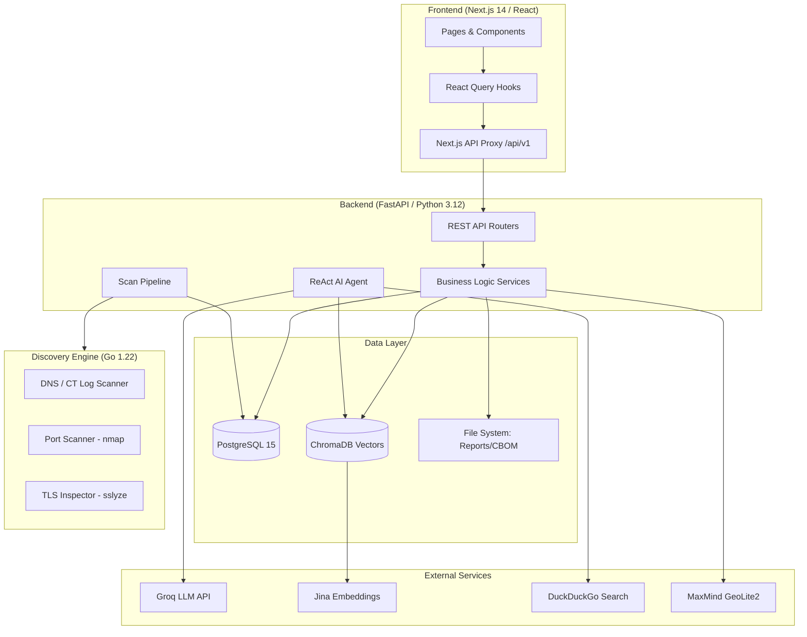
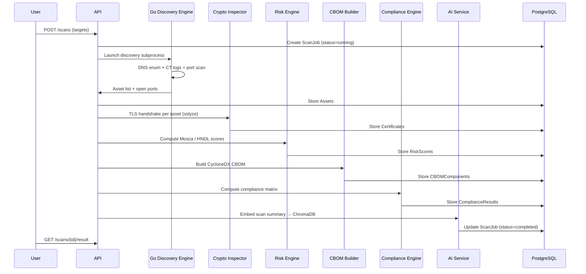

# QuShield-PnB

> **Post-Quantum Cryptography Security Intelligence Platform for Indian Banking Infrastructure**

QuShield-PnB is a full-stack security intelligence platform that scans, analyses, and monitors the cryptographic posture of banking infrastructure against the emerging threat of Cryptographically Relevant Quantum Computers (CRQCs). It provides asset discovery, TLS/certificate analysis, CBOM generation, quantum risk scoring (Mosca's theorem + Monte Carlo simulation), regulatory compliance tracking (RBI, SEBI, FIPS), an AI-powered assistant, and automated report generation.

---

## Table of Contents

1. [Quick Start](#quick-start)
2. [Project Overview & Vision](#project-overview--vision)
3. [Features & Capabilities](#features--capabilities)
4. [System Architecture](#system-architecture)
5. [Setup Guides](#setup-guides)
6. [REST API Reference](#rest-api-reference)
7. [Project Structure](#project-structure)
8. [Business Logic Deep-Dives](#business-logic-deep-dives)
9. [Environment Variables](#environment-variables)

---

## Quick Start

### Prerequisites
- Docker 24+ and Docker Compose v2
- A free [Groq API key](https://console.groq.com) for the AI assistant
- (Optional) Jina AI key for enhanced embeddings
- (Optional) MaxMind GeoLite2 database for GeoIP mapping

### 5-Minute Docker Setup

```bash
# 1. Clone the repository
git clone https://github.com/blakktyger/QuShield-PnB.git
cd QuShield-PnB

# 2. Create your environment file
cp .env.example .env
# Edit .env and add your API keys (see Environment Variables section)

# 3. Download GeoLite2 database (optional, for GeoIP map)
mkdir -p data/geolite
# Place GeoLite2-City.mmdb at data/geolite/GeoLite2-City.mmdb

# 4. Build and start all services
docker compose up --build -d

# 5. Open the application
open http://localhost:3000
```

**Default credentials:** Register a new account at `http://localhost:3000` — no default admin account.

**API Documentation:** Available at `http://localhost:8000/docs` (Swagger UI) once the backend is running.

---

## Project Overview & Vision

### The Problem

Banking infrastructure is built on RSA and ECC cryptography that will be broken by quantum computers within this decade. NIST estimates a Cryptographically Relevant Quantum Computer (CRQC) has a 50% probability of arriving by 2032 (P50). Yet most banks have no visibility into:

- Which assets use quantum-vulnerable cryptography
- How much time they have before CRQC arrives vs. how long migration will take
- Which certificates will still be active when CRQC breaks current algorithms
- Whether they meet RBI IT Framework 2023, SEBI CSCRF, or FIPS 203/204/205 requirements

The **Harvest Now, Decrypt Later (HNDL)** attack is already underway — adversaries collect encrypted traffic today to decrypt once CRQC arrives. For banking data with 5+ year sensitivity (SWIFT logs, transaction records), HNDL exposure is already active.

### Our Solution

QuShield-PnB automates the discovery, assessment, and monitoring of cryptographic risk across an entire banking network. It translates complex PQC mathematics into actionable intelligence that security teams, CTOs, and regulators can act on.

### Target Users

- **Indian banks** under RBI IT Framework 2023 and SEBI CSCRF obligations
- **NPCI-connected payment processors** handling SWIFT, UPI, IMPS transaction data
- **CISOs and security architects** building PQC migration roadmaps
- **Compliance officers** preparing regulatory submissions

---

## Features & Capabilities

### Discovery & Asset Intelligence
- **Automated subdomain enumeration** via certificate transparency logs (crt.sh) and DNS brute-force
- **Port scanning** using nmap with TLS service detection
- **Shadow asset detection** — identifies internet-facing assets not in the official asset register
- **Third-party asset tagging** — flags assets hosted by cloud vendors (AWS, GCP, Azure, Cloudflare)
- **Asset type inference** — automatically classifies assets as swift, core_banking, internet_banking, web, dns, api, mail
- **GeoIP mapping** — visualises all discovered IPs on an interactive world map with MaxMind GeoLite2

### Cryptographic Analysis
- **Full TLS handshake inspection** using sslyze — cipher suites, protocol versions, key exchange algorithms
- **Certificate parsing** — extracts issuer, common name, signature algorithm, key size, validity period
- **Quantum vulnerability classification** — RSA < 4096 and all ECC are quantum-vulnerable
- **CBOM generation** — Cryptographic Bill of Materials in CycloneDX-compatible format
- **Algorithm frequency analysis** — identifies most common algorithms across the entire portfolio
- **Certificate expiry vs CRQC race** — classifies each cert as safe/natural_rotation/at_risk

### Quantum Risk Scoring
- **Mosca's theorem** implementation with per-asset X (migration time) and Y (data shelf life) parameters
- **HNDL exposure window** with data sensitivity multipliers:
  - SWIFT/inter-bank: 5.0× multiplier
  - Core banking: 3.5× multiplier
  - Internet banking: 3.0× multiplier
  - Web/DNS: 0.5–1.0× multiplier
- **Monte Carlo CRQC simulation** — 10,000-sample log-normal distribution replacing static 3-scenario model
  - Adjustable mode_year and sigma sliders for real-time curve updates
  - P5/P50/P95 percentile annotations
  - Per-asset and portfolio-level exposure probabilities
- **Migration complexity scoring** — dynamic X calculation based on:
  - Asset type base time
  - Crypto agility score penalty
  - Third-party dependency penalty (+1yr)
  - Certificate pinning penalty (+1yr)
  - No forward secrecy penalty (+0.5yr)
  - Maximum cap: 8 years
- **Enterprise Quantum Readiness Rating** — composite 0–1000 score across 6 dimensions
- **Risk heatmap** — Mosca X/Y scatter plot with threshold line

### PQC Compliance Engine
- **FIPS 203 (ML-KEM)** deployment tracking — Kyber key encapsulation
- **FIPS 204 (ML-DSA)** deployment tracking — Dilithium signatures
- **FIPS 205 (SLH-DSA)** deployment tracking — SPHINCS+ hash-based signatures
- **RBI IT Framework 2023** compliance matrix per asset
- **SEBI CSCRF** cryptographic compliance tracking
- **PCI DSS 4.0** TLS/cipher compliance
- **Crypto agility score** (0–100) — measures how easily an asset can swap algorithms
- **TLS 1.3 enforcement** tracking
- **Hybrid mode** (classical + PQC simultaneously) detection

### AI Assistant (ReAct Agent)
- **LlamaIndex ReActAgent** with Groq llama-3.3-70b-versatile LLM
- **4 integrated tools:**
  - `rag_search` — semantic search over ChromaDB knowledge base + user scan vectors
  - `sql_query` — natural language queries over scan data via in-memory SQLite (tenant-isolated)
  - `load_report_json` — loads and analyses previously generated reports
  - `web_search` — DuckDuckGo internet search for current PQC news
- **Scan-scoped queries** — AI can be constrained to a specific scan's data
- **Streaming SSE responses** — real-time token streaming with reasoning trace display
- **3 chat modes** — ReAct Agent (full tools), RAG Search (knowledge base only), SQL Query (tabular data)
- **ChromaDB knowledge base** — 11 bundled knowledge files covering NIST FIPS, RBI, SEBI, NPCI, HNDL, vendor PQC status, migration guides, Monte Carlo simulation

### Report Generation
- **6 report templates:**
  - Executive Summary — board-level with KPIs, risk posture, 90-day roadmap
  - Full Scan Report — detailed technical findings, all assets, CRQC simulation
  - RBI Submission — regulatory compliance report for RBI IT Framework 2023
  - CBOM Audit — cryptographic bill of materials with algorithm inventory
  - Migration Progress — current PQC adoption tracking
  - PQC Migration Plan — phased 4-phase migration roadmap
- **AI-enriched narratives** — each section uses Groq to generate contextual analysis
- **PDF, HTML, JSON, CSV** output formats
- **CRQC simulation embedded** in executive and full scan reports (P5/P50/P95 + cert race)
- **Scheduled reports** — APScheduler-powered cron scheduling

### Topology & Visualisation
- **Network topology graph** — D3.js force-directed graph of asset relationships
- **Node filtering** by risk level, asset type, HNDL status
- **Interactive GeoIP world map** — Leaflet.js with clustered markers
- **Risk heatmap scatter** — Mosca parameter correlation
- **Monte Carlo probability curve** — interactive AreaChart with animated slider updates

---

## System Architecture

### High-Level Component Overview



### Scan Pipeline Flow



### AI Assistant Architecture

```mermaid
graph LR
    subgraph Frontend
        Chat[Chat UI]
        SSE[SSE Stream Reader]
    end

    subgraph Agent["ReAct Agent (LlamaIndex)"]
        LLM[Groq llama-3.3-70b]
        Thought[Thought Loop max_iterations=8]
    end

    subgraph Tools
        RAG[rag_search\nChromaDB semantic]
        SQL[sql_query\nIn-memory SQLite]
        JSON[load_report_json\nFS report files]
        Web[web_search\nDuckDuckGo]
    end

    subgraph Knowledge
        KB[Global KB\n11 PQC documents]
        Vectors[User Scan Vectors\ntenant-isolated]
        Reports[Generated Reports\nJSON snapshots]
        SQLiteDB[Ephemeral SQLite\nassets/certs/risks/compliance]
    end

    Chat -->|POST /ai/agent/chat\n{message, scan_id}| Agent
    Agent --> LLM
    LLM --> Thought
    Thought --> RAG
    Thought --> SQL
    Thought --> JSON
    Thought --> Web
    RAG --> KB
    RAG --> Vectors
    JSON --> Reports
    SQL --> SQLiteDB
    Agent -->|SSE stream\nthought/tool/answer events| SSE
    SSE --> Chat
```

### Database Schema (Key Tables)

```
users              scan_jobs           assets
──────────         ──────────          ──────────
id (UUID)          id (UUID)           id (UUID)
email              user_id → users     scan_id → scan_jobs
hashed_password    targets[]           hostname
created_at         status              ip_address
                   scan_type           asset_type
                   created_at          is_shadow
                   completed_at        is_third_party

certificates       risk_scores         cbom_components
──────────────     ──────────────      ───────────────
id (UUID)          asset_id → assets   id (UUID)
asset_id           scan_id             asset_id
scan_id            base_score (0-1000) scan_id
issuer             risk_classification algorithm_name
common_name        quantum_readiness   algorithm_type
signature_alg      hndl_exposed        key_size
is_quantum_vuln    mosca_x             is_quantum_vuln
valid_from/to      mosca_y

compliance_results
──────────────────
asset_id
scan_id
compliance_pct
crypto_agility_score
rbi_compliant
sebi_compliant
pci_compliant
tls_13_enforced
hybrid_mode_active
fips_203_deployed / 204 / 205
```

---

## Setup Guides

### Option 1: Docker (Recommended)

**Linux / macOS:**
```bash
# Install Docker and Docker Compose v2
# Ubuntu: sudo apt install docker.io docker-compose-plugin
# macOS: Install Docker Desktop from docker.com

git clone https://github.com/blakktyger/QuShield-PnB.git
cd QuShield-PnB

# Create .env file
cat > .env << 'EOF'
GROQ_API_KEY=gsk_your_key_here
OPENAI_API_KEY=sk-optional
JINA_API_KEY=jina_optional
EOF

# Start everything
docker compose up --build -d

# Check logs
docker compose logs -f backend
docker compose logs -f frontend
```

**Windows:**
```powershell
# Install Docker Desktop (WSL2 backend recommended)
git clone https://github.com/blakktyger/QuShield-PnB.git
cd QuShield-PnB

# Create .env
echo GROQ_API_KEY=gsk_your_key_here > .env

# Start
docker compose up --build -d
```

**Verify everything is running:**
```bash
curl http://localhost:8000/health
# Expected: {"status": "healthy", "version": "..."}

curl http://localhost:3000
# Expected: HTML response (Next.js frontend)
```

---

### Option 2: Local Development (Without Docker)

#### Backend Setup

**Requirements:** Python 3.12, PostgreSQL 15, nmap, sslscan

```bash
# Ubuntu/Debian
sudo apt install python3.12 python3.12-venv postgresql-15 nmap sslscan

# macOS (Homebrew)
brew install python@3.12 postgresql@15 nmap

# 1. Create and activate virtual environment
cd QuShield-PnB
python3.12 -m venv .venv
source .venv/bin/activate  # Windows: .venv\Scripts\activate

# 2. Install Python dependencies
pip install -r backend/requirements.txt

# 3. Set up PostgreSQL
sudo -u postgres psql << 'EOF'
CREATE USER qushield WITH PASSWORD 'changeme_local_dev';
CREATE DATABASE qushield OWNER qushield;
GRANT ALL PRIVILEGES ON DATABASE qushield TO qushield;
EOF

# 4. Configure environment
cp .env.example .env
# Edit .env: set POSTGRES_HOST=localhost and your API keys

# 5. Run database migrations
cd backend
alembic upgrade head

# 6. Seed knowledge base (first run only)
python scripts/seed_knowledge.py

# 7. Start backend
PYTHONPATH=/path/to/QuShield-PnB/backend uvicorn app.main:app --reload --host 0.0.0.0 --port 8000
```

#### Frontend Setup

**Requirements:** Node.js 20+

```bash
# Install Node.js 20 (via nvm recommended)
curl -o- https://raw.githubusercontent.com/nvm-sh/nvm/v0.39.0/install.sh | bash
nvm install 20 && nvm use 20

cd QuShield-PnB/frontend

# Install dependencies
npm install

# Set backend URL for local dev
echo "BACKEND_URL=http://localhost:8000" > .env.local

# Start dev server
npm run dev
# → http://localhost:3000
```

#### Build Go Discovery Engine

```bash
# Install Go 1.22
wget https://go.dev/dl/go1.22.0.linux-amd64.tar.gz
sudo tar -C /usr/local -xzf go1.22.0.linux-amd64.tar.gz
export PATH=$PATH:/usr/local/go/bin

cd QuShield-PnB/discovery
go build -o bin/discovery-engine .
```

#### GeoIP Database Setup

1. Register free account at [maxmind.com](https://www.maxmind.com/en/geolite2/signup)
2. Download `GeoLite2-City.mmdb`
3. For Docker: place at `data/geolite/GeoLite2-City.mmdb`
4. For local dev: set `GEOIP_DB_PATH=/path/to/GeoLite2-City.mmdb` in `.env`

---

### Option 3: Production Deployment Notes

- Set `APP_ENV=production` and use strong `SECRET_KEY` in `.env`
- Use managed PostgreSQL (AWS RDS, Cloud SQL) — update `POSTGRES_*` vars
- Mount persistent volumes for ChromaDB (`/app/data/chroma`) and reports (`/app/data/reports`)
- Put Nginx or Caddy in front of both services for TLS termination
- Use `docker compose -f docker-compose.yml -f docker-compose.prod.yml up -d` with a production override file

---

## REST API Reference

Base URL: `http://localhost:8000/api/v1`
All endpoints (except `/auth/register` and `/auth/login`) require: `Authorization: Bearer <token>`

### Auth

| Method | Path | Description |
|--------|------|-------------|
| POST | `/auth/register` | Register new user |
| POST | `/auth/login` | Login, returns JWT token |
| GET | `/auth/me` | Get current user info |

### Scans

| Method | Path | Description |
|--------|------|-------------|
| POST | `/scans` | Start a full deep scan |
| POST | `/scans/quick` | Start a quick scan (TLS only, no discovery) |
| POST | `/scans/shallow` | Shallow scan (DNS + ports only) |
| GET | `/scans` | List all scans for current user |
| GET | `/scans/{scan_id}` | Get scan status |
| GET | `/scans/{scan_id}/result` | Get full scan result |
| GET | `/scans/{scan_id}/summary` | Get scan summary stats |
| GET | `/scans/{scan_id}/stream` | SSE stream of live scan progress |
| POST | `/scans/{scan_id}/cancel` | Cancel a running scan |

### Assets

| Method | Path | Description |
|--------|------|-------------|
| GET | `/assets` | List assets (filter by scan_id, risk, type) |
| GET | `/assets/{asset_id}` | Get asset detail with certs + CBOM |
| GET | `/assets/search` | Full-text search assets |
| GET | `/assets/shadow` | List shadow/unmanaged assets |
| GET | `/assets/third-party` | List third-party hosted assets |

### Risk

| Method | Path | Description |
|--------|------|-------------|
| GET | `/risk/scan/{scan_id}` | Risk scores for all assets in scan |
| GET | `/risk/scan/{scan_id}/heatmap` | Portfolio risk heatmap data |
| GET | `/risk/asset/{asset_id}` | Detailed risk analysis for one asset |
| GET | `/risk/scan/{scan_id}/hndl` | HNDL exposure analysis |
| POST | `/risk/mosca/simulate` | Run Mosca's theorem simulation |
| GET | `/risk/scan/{scan_id}/enterprise-rating` | Enterprise quantum readiness rating (0–1000) |
| GET | `/risk/scan/{scan_id}/migration-plan` | Per-asset PQC migration plan |
| POST | `/risk/monte-carlo/simulate` | CRQC arrival probability distribution |
| POST | `/risk/monte-carlo/asset-exposure` | Single asset Mosca Monte Carlo |
| GET | `/risk/scan/{scan_id}/monte-carlo` | Full portfolio Monte Carlo simulation |
| GET | `/risk/scan/{scan_id}/cert-race` | Certificate expiry vs CRQC race analysis |

### CBOM

| Method | Path | Description |
|--------|------|-------------|
| GET | `/cbom/scan/{scan_id}` | Full CBOM for scan |
| GET | `/cbom/asset/{asset_id}` | CBOM for single asset |
| GET | `/cbom/asset/{asset_id}/export` | Export CBOM as CycloneDX JSON |
| GET | `/cbom/scan/{scan_id}/aggregate` | Aggregated algorithm statistics |
| GET | `/cbom/scan/{scan_id}/algorithms` | Algorithm frequency breakdown |

### Compliance

| Method | Path | Description |
|--------|------|-------------|
| GET | `/compliance/scan/{scan_id}/fips-matrix` | FIPS 203/204/205 compliance matrix |
| GET | `/compliance/scan/{scan_id}/regulatory-deadlines` | Regulatory deadline tracking |
| GET | `/compliance/asset/{asset_id}` | Compliance detail for single asset |

### Topology & GeoIP

| Method | Path | Description |
|--------|------|-------------|
| GET | `/topology/{scan_id}` | Network topology graph (nodes + edges) |
| GET | `/geo/{scan_id}` | GeoIP data for all assets in scan |

### AI

| Method | Path | Description |
|--------|------|-------------|
| POST | `/ai/chat` | Legacy RAG/SQL chat (mode: auto/rag/sql) |
| POST | `/ai/agent/chat` | Streaming ReAct agent (SSE, supports scan_id scoping) |
| GET | `/ai/agent/status` | Check agent availability + model info |
| GET | `/ai/status` | AI service status and deployment mode |
| GET | `/ai/models` | Available AI models |
| POST | `/ai/embed/{scan_id}` | Embed scan data into ChromaDB vectors |
| POST | `/ai/migration-roadmap/{scan_id}` | Generate AI migration roadmap |

### Reports

| Method | Path | Description |
|--------|------|-------------|
| POST | `/reports/generate/{scan_id}` | Generate report (type, format params) |
| GET | `/reports/saved` | List saved reports |
| GET | `/reports/saved/{report_id}/download` | Download report file |
| DELETE | `/reports/saved/{report_id}` | Delete saved report |
| GET | `/reports/chart-data/{scan_id}` | Chart data for report rendering |
| POST | `/reports/schedule` | Schedule recurring report |
| GET | `/reports/schedules` | List active schedules |
| DELETE | `/reports/schedules/{schedule_id}` | Delete schedule |

---

## Project Structure

```
QuShield-PnB/
├── backend/
│   ├── app/
│   │   ├── api/v1/          # FastAPI route handlers
│   │   │   ├── auth.py      # JWT auth endpoints
│   │   │   ├── scans.py     # Scan lifecycle management
│   │   │   ├── assets.py    # Asset CRUD + search
│   │   │   ├── risk.py      # Risk scoring + Monte Carlo
│   │   │   ├── cbom.py      # CBOM + CycloneDX export
│   │   │   ├── compliance.py # FIPS/RBI/SEBI matrix
│   │   │   ├── topology.py  # Network graph
│   │   │   ├── geo.py       # GeoIP endpoints
│   │   │   ├── ai.py        # AI chat + agent streaming
│   │   │   └── reports.py   # Report generation + scheduling
│   │   ├── core/
│   │   │   ├── database.py  # SQLAlchemy session management
│   │   │   ├── logging.py   # Structured JSON logging
│   │   │   └── timing.py    # Performance timing decorator
│   │   ├── models/          # SQLAlchemy ORM models
│   │   ├── schemas/         # Pydantic request/response schemas
│   │   ├── services/
│   │   │   ├── scan_orchestrator.py  # Scan pipeline coordination
│   │   │   ├── crypto_inspector.py   # sslyze TLS analysis
│   │   │   ├── risk_engine.py        # Mosca + HNDL + complexity scoring
│   │   │   ├── monte_carlo.py        # CRQC arrival simulation
│   │   │   ├── cbom_builder.py       # CycloneDX CBOM generation
│   │   │   ├── compliance_engine.py  # FIPS/RBI/SEBI scoring
│   │   │   ├── react_agent.py        # LlamaIndex ReAct agent
│   │   │   ├── sql_agent.py          # Tabular NL→SQL agent
│   │   │   ├── vector_store.py       # ChromaDB user vectors
│   │   │   ├── knowledge_seeder.py   # Global KB seeding
│   │   │   ├── report_generator.py   # PDF/HTML report generation
│   │   │   ├── roadmap_agent.py      # PQC migration roadmap AI
│   │   │   ├── geo_service.py        # MaxMind GeoIP lookup
│   │   │   └── ai_service.py         # LLM abstraction layer
│   │   ├── templates/       # Jinja2 HTML report templates
│   │   │   ├── executive.html
│   │   │   ├── full_scan.html
│   │   │   ├── rbi_submission.html
│   │   │   ├── cbom_audit.html
│   │   │   ├── migration_progress.html
│   │   │   └── pqc_migration_plan.html
│   │   └── main.py          # FastAPI app factory + router registration
│   ├── data/knowledge/      # ChromaDB knowledge base text files (11 docs)
│   ├── requirements.txt
│   ├── alembic/             # Database migration scripts
│   └── Dockerfile
│
├── frontend/
│   ├── src/
│   │   ├── app/             # Next.js App Router pages
│   │   │   ├── page.tsx     # Quick Scan (home)
│   │   │   ├── dashboard/   # PQC Dashboard
│   │   │   ├── assets/      # Asset Inventory
│   │   │   ├── cbom/        # CBOM Explorer
│   │   │   ├── risk/        # Risk Intelligence
│   │   │   │   └── monte-carlo/  # Monte Carlo simulation page
│   │   │   ├── compliance/  # PQC Compliance
│   │   │   ├── topology/    # Network Topology
│   │   │   ├── geo/         # GeoIP Map
│   │   │   ├── history/     # Scan History
│   │   │   ├── reports/     # Report Generation
│   │   │   └── ai/          # AI Assistant
│   │   ├── components/
│   │   │   ├── layout/      # Sidebar, TopNav
│   │   │   └── ui/          # Shared components (ScanSelector, RiskBadge, etc.)
│   │   └── lib/
│   │       ├── hooks.ts     # All React Query hooks
│   │       ├── api.ts       # Axios instance with auth interceptor
│   │       └── types.ts     # TypeScript interfaces
│   ├── next.config.ts       # Next.js config with /api/v1 proxy
│   └── Dockerfile
│
├── discovery/               # Go 1.22 Discovery Engine
│   ├── main.go
│   └── bin/                 # Compiled binary
│
├── data/
│   └── geolite/             # Place GeoLite2-City.mmdb here
│
├── docs/                    # Extended design documents
├── docker-compose.yml       # Production compose
├── docker-compose.local.yml # Local dev compose (hot reload)
└── .env.example             # Environment variable template
```

---

## Business Logic Deep-Dives

### 1. Mosca's Theorem

Mosca's theorem defines urgency as: **X + Y > Z → act now**

- **X** = Migration time: years to fully deploy PQC across an asset
- **Y** = Data shelf life: years the encrypted data must remain confidential  
- **Z** = Years until CRQC arrives

If X + Y exceeds the time remaining before CRQC, the data is at risk before migration completes.

QuShield computes X dynamically via `compute_migration_complexity()`:
```
base_time (by asset_type) + crypto_agility_penalty + third_party_penalty + pinning_penalty + no_fs_penalty
```
Capped at 8 years. Y (shelf life) is set per asset type (SWIFT: 10yr, core banking: 7yr, web: 2yr).

### 2. HNDL — Harvest Now, Decrypt Later

HNDL represents the active threat today even before CRQC exists. Attackers are collecting encrypted traffic now, storing it, and will decrypt once quantum computers arrive.

QuShield scores HNDL exposure with sensitivity multipliers:
```python
SENSITIVITY_MULTIPLIERS = {
    "swift": 5.0,
    "core_banking": 3.5,
    "internet_banking": 3.0,
    "web": 1.0,
    "dns": 0.5,
}
```

An asset is HNDL-exposed if it uses quantum-vulnerable algorithms (RSA/ECC) AND transmits data with shelf life > 0. Higher-sensitivity assets score much higher in the risk model.

### 3. Monte Carlo CRQC Simulation

Replaces static 3-scenario modelling with a full probability distribution:

**Algorithm:**
1. Model CRQC arrival as log-normal distribution: `mu = ln(mode_year - min_year)`, `sigma_ln = sigma / offset`
2. Sample 10,000 arrival years from `lognormal(mu, sigma_ln) + min_year`
3. Clip to `[2027, 2045]`
4. For each asset: `exposed_i = (X + Y) > (Z_i - reference_year)`
5. `P(exposed) = sum(exposed_i) / 10,000`

**Why log-normal:** The distribution has a natural lower bound (CRQC impossible before 2027) and a heavy right tail (delays are more likely than early arrival), matching the asymmetric uncertainty of quantum computing timelines.

### 4. Migration Complexity Scoring

Static migration times are too optimistic. QuShield computes per-asset complexity:

```
complexity = base_time[asset_type]
           + (50 - crypto_agility_score) / 50 × 2  # agility penalty: 0–2yr
           + 1.0 if is_third_party
           + 1.0 if has_certificate_pinning
           + 0.5 if not forward_secrecy
complexity = min(complexity, 8.0)
```

Assets with poor crypto agility (hardcoded algorithms, no abstraction layer) take 2+ extra years to migrate — this directly impacts Mosca's Z threshold.

### 5. Crypto Agility Score

Scores 0–100 based on whether an asset demonstrates algorithmic flexibility:
- TLS 1.3 enforced: +20 pts
- Multiple cipher suite support: +10 pts
- Forward secrecy enabled: +15 pts
- Hybrid mode active (classical + PQC): +25 pts
- FIPS 203/204 deployed: +15 pts each
- No certificate pinning: +10 pts

Higher scores mean faster, cheaper PQC migration.

### 6. Certificate Race Classification

Each certificate is classified relative to the CRQC P50 median arrival year:
- **Safe**: Already uses PQC algorithm (ML-KEM, ML-DSA, SLH-DSA)
- **Natural Rotation**: `valid_to < crqc_median_year` — expires before CRQC, replace with PQC at next renewal
- **At Risk**: `valid_to >= crqc_median_year` AND uses quantum-vulnerable algorithm — requires emergency out-of-band replacement

### 7. Enterprise Quantum Readiness Rating (0–1000)

Six weighted dimensions:
| Dimension | Weight | Description |
|-----------|--------|-------------|
| Algorithm strength | 25% | How strong current algorithms are vs. quantum threat |
| Migration readiness | 20% | How close to PQC deployment |
| Compliance posture | 20% | RBI/SEBI/FIPS compliance level |
| Certificate hygiene | 10% | Certificate validity and algorithm quality |
| Crypto agility | 15% | Ability to swap algorithms quickly |
| Threat exposure | 10% | HNDL exposure and shadow asset count |

Score < 300: Critical — immediate action  
Score 300–550: Vulnerable — active programme needed  
Score 550–750: Aware — progressing  
Score > 750: Ready — on track for PQC transition

---

## Environment Variables

| Variable | Required | Description |
|----------|----------|-------------|
| `GROQ_API_KEY` | **Yes (AI)** | Groq API key for llama-3.3-70b-versatile. Get at console.groq.com |
| `OPENAI_API_KEY` | No | OpenAI fallback API key |
| `JINA_API_KEY` | No | Jina AI embeddings (better quality than local model) |
| `POSTGRES_HOST` | Yes | PostgreSQL hostname (default: `db` in Docker) |
| `POSTGRES_PORT` | Yes | PostgreSQL port (default: `5432`) |
| `POSTGRES_USER` | Yes | PostgreSQL username |
| `POSTGRES_PASSWORD` | Yes | PostgreSQL password |
| `POSTGRES_DB` | Yes | PostgreSQL database name |
| `SECRET_KEY` | Yes (prod) | JWT signing secret — use `openssl rand -hex 32` |
| `GEOIP_DB_PATH` | No | Path to GeoLite2-City.mmdb (default: `/app/geoip/GeoLite2-City.mmdb`) |
| `REPORTS_DIR` | No | Directory for saved reports (default: `/app/data/reports`) |
| `MPLBACKEND` | No | Set to `Agg` for headless matplotlib (no display required) |
| `PYTHONPATH` | No | Set to `/app` inside Docker for clean imports |
| `LOG_LEVEL` | No | Logging level: `DEBUG`, `INFO`, `WARNING` (default: `INFO`) |
| `APP_ENV` | No | `development` or `production` |
| `BACKEND_URL` | No (frontend) | Backend URL for Next.js proxy (default: `http://localhost:8000`) |

**`.env.example`:**
```env
# Required for AI features
GROQ_API_KEY=gsk_your_groq_key_here

# Optional AI enhancements
OPENAI_API_KEY=sk-optional
JINA_API_KEY=jina_optional

# Database (defaults work for Docker)
POSTGRES_HOST=db
POSTGRES_PORT=5432
POSTGRES_USER=qushield
POSTGRES_PASSWORD=changeme_local_dev
POSTGRES_DB=qushield

# Security — CHANGE IN PRODUCTION
SECRET_KEY=dev_secret_change_in_production_use_openssl_rand_hex_32

# Optional paths
GEOIP_DB_PATH=/app/geoip/GeoLite2-City.mmdb
REPORTS_DIR=/app/data/reports

# Frontend
BACKEND_URL=http://backend:8000
```

---

## License

This project is proprietary software developed for Punjab National Bank (PnB) quantum security research. Not for redistribution without authorisation.